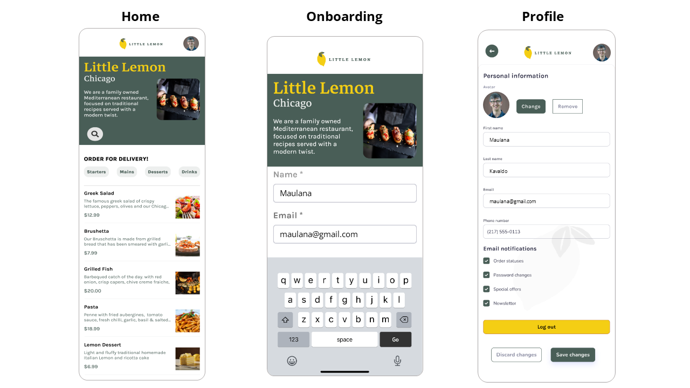

# Little Lemon Food Ordering App using React

## Screenshots

  <p><strong>Wireframe:</strong></p>
    <p align="center">
      
    </p>
  <p><strong>LittleLemon:</strong></p>
    <p align="center">
      
    </p>


## Running the Project
1. **Start the development server**
    ```bash
    npm start
    ```
    This will start the React development server and typically open your default browser to 
    ```bash
    http://localhost:3000
    ```


2. **Build the project for production**
    
    To create an optimized build of the project, run:
    ```bash
    npm run build
    ```    
    This will create a build directory with all the production files.


### _Star this repository if it is useful. Thank you ! :)_